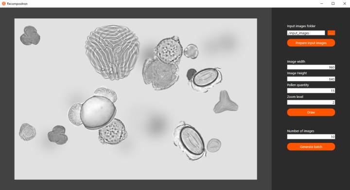
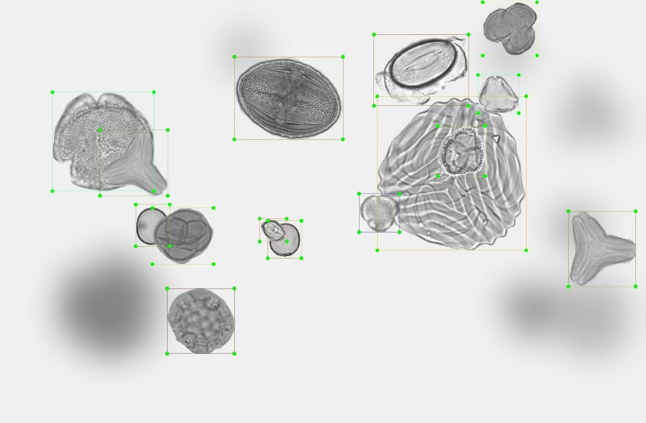

# Introduction 
Recompositron is a tool to generate batch pollen images as they could be observed under a microscope. The generated images can then be used to train an object detection AI model to detect and classify pollens.

The Recompositron tool uses black and white clipped pollens images to generate random compositions in JPEG format. An XML file is also generated along each image allowing to label each pollen composing it.

# Getting Started
In order to use the Recompositron tool:
## Setup
1.  Clone this repository
2.  (Optional) Add clipped black and white pollen images in the **input_images** folder.
3.  (Optional) Add background images in the **background_images** folder. Background images **must be in PNG format**.
## Usage
1.  Find and execute **Recompositron.exe** in "\src\PollenDetector\Tools\Recompositron\"
2.  (Optional) Browse a folder for your own input images. 
3.  If you modified the **input images** folder or if it is the first time you use the Recompositron tool, click the **Prepare images** button. It will generate rotated and cropped version of each input image and store them in the **rotated_images** and **augmented_images** respectively. (you only need to do this step once as long as you don't modify the files).
4.  Set the size (width and height) of the images to generate, the amount of pollens you want to have in each generated image, the zoom level you want and click the **Draw** button.
5.  If you are satisfied with the result, select the amount of images you wish to generate and click the **Generate images** button. It is recommended not to set the amount of images to generate to a too large number as the tool will likely crash (1000 should be fine). You can always generate additional images by clicking the button again once the previous generation step is done.
6.  All the generated images and their corresponding XML files can be found in the **output_images** folder.

## Known issues
1.  The current version of the Recompositron has no visual feedback on the tasks that are performed for image preparation and image generation. You can monitor progress by checking the **rotated_images** and **augmented_image** folders for the image preparation task, and the **output_images** folder for the image generation task.
2.  The "Scale and layout" Windows display setting may interfere with the Recompositron. If it is not set to 100%, pollen images may appear truncated.
